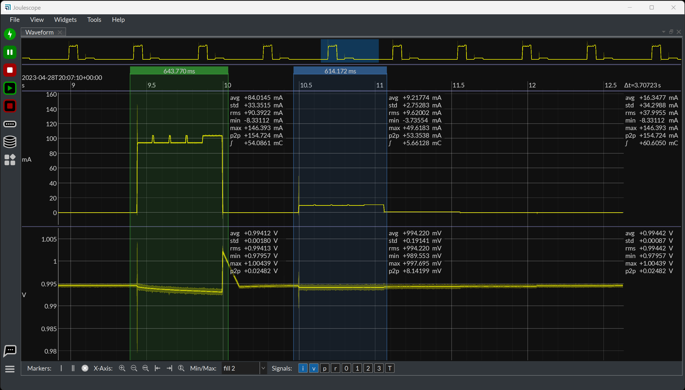

# 

Welcome to the Joulescope™ User Interface software repo!
Joulescope is an affordable, precision DC energy
analyzer that enables you to build better products.
Joulescope™ accurately and simultaneously measures the voltage and current
supplied to your target device, and it then computes power and energy.
For more information on Joulescope, see
[www.joulescope.com](https://www.joulescope.com).

This repository contains the Joulescope's graphical User Interface (UI).
The UI runs on a host computer and communicates with the Joulescope device
over USB.  The application source code is available at
https://github.com/jetperch/pyjoulescope_ui.  

The software is highly configurable.  Here is the Multimeter view on Windows 11:

And here is the Oscilloscope waveform view on Windows 11:

For more information, see:

* [Tips](docs/tips.md): for using the UI.
* [Changelog](CHANGELOG.md): list of changes by release
* [Future features](docs/features_future.md)
* [Developer notes](docs/dev.md)
* [PubSub](docs/pubsub.md)

## Quick start using official distribution

We provide official distributions for Windows, macOS and Ubuntu 22.04LTS.

You can download the latest and previous alpha, beta, and stable builds
[here](https://download.joulescope.com/joulescope_install/index_v2.html).
Visit the main [download](https://www.joulescope.com/download) 
page for the latest stable build.

## Run as python package

The Joulescope UI is a python package which you can install for pypi or
run directly from source.

### Install Python

The Joulescope User Interface requires Python 3.9 or newer.
We recommend Python 3.11.
Install [Python 3.9+](https://www.python.org/) on your system and then verify
your python version at the terminal or command line:

    > python3 -VV
    Python 3.10.10 (tags/v3.10.10:aad5f6a, Feb  7 2023, 17:20:36) [MSC v.1929 64 bit (AMD64)]

Ensure that you have Python 3.9 or newer and 64-bit.

### Configure virtualenv [optional]

Although not required, using
[virtualenv](https://virtualenv.pypa.io/en/latest/)
avoids dependency conflicts, especially if you use your python installation for
other programs.  Using virtualenv ensures that
the Joulescope software has the right dependencies without changing the rest
of your system.

#### For Windows:

Install virtualenv and create a new virtual environment:

    python3 -v venv c:\venv\joulescope

Activate the virtual environment whenever you start a new terminal:

    c:\venv\joulescope\Scripts\activate

#### For POSIX including (Linux, Mac OS X with homebrew):

Install virtualenv and create a new virtual environment:

    python3 -m venv ~/venv/joulescope

Activate the virtual environment whenever you start a new terminal:

    . ~/venv/joulescope/bin/activate

### Option 1: Install from pypi

Installation from pypi is easy:

    pip3 install -U joulescope_ui
    
If you just want to run the latest released version of the UI, use this option!

### Option 2: Clone, install and run from source

Clone and configure the Joulescope UI from the terminal or command line:

    git clone https://github.com/jetperch/pyjoulescope_ui.git
    cd pyjoulescope_ui
    pip3 install -U -r requirements.txt

Make any optional modifications you want to the source code.  Then build and
install the source:

    python3 setup.py sdist
    pip3 install dist/joulescope_ui-{version}.tar.gz

You can then run from any directory:

    python3 -m joulescope_ui

If you see an error importing win32api on Windows, you should try running this
command from an Administrator command prompt:

   python {path_to_python}\scripts\pywin32_postinstall.py -install

### Option 3: Develop the UI

Clone and configure the Joulescope UI from the terminal or command line:

    git clone https://github.com/jetperch/pyjoulescope_ui.git
    cd pyjoulescope_ui
    pip3 install -U -r requirements.txt

Build the QT resources:

    python3 setup.py sdist

As long as the current directory is the source directory, you can run:

    python3 -m joulescope_ui

If you want to run from another directory, you will need to add the source
to your PYTHONPATH environment variable.  On Windows:

    set PYTHONPATH={C:\path\to\repos}\pyjoulescope_ui

and on POSIX (Linux, Mac OS X with homebrew):

    export PYTHONPATH={path/to/repos}/pyjoulescope_ui

To also distribute the UI on macOS, you need to install XCode and then
configure node:

    brew install node
    npm install

You will also need to install the signing certificate using
Applications/Utilities/Keychain Access.

### Option 4: Develop both UI and driver

If you also want to simultaneously develop the Joulescope UI and the
Joulescope driver:

    pip3 uninstall joulescope
    cd {path/to/repos}
    git clone https://github.com/jetperch/joulescope_driver.git
    cd joulescope_driver
    pip3 install -U -r requirements.txt
    python3 setup.py build_ext --inplace && python -m unittest
    git clone https://github.com/jetperch/pyjoulescope.git
    cd pyjoulescope
    pip3 install -U -r requirements.txt    
    python3 setup.py build_ext --inplace && python -m unittest

You should then modify your python path to find both the UI and driver
source paths. On Windows:

    set PYTHONPATH={C:\path\to\repos}\joulescope_driver;C:\path\to\repos}\pyjoulescope;{C:\path\to\repos}\pyjoulescope_ui

and on POSIX (Linux, Mac OS X with homebrew):

    export PYTHONPATH={path/to/repos}/pyjoulescope:{path/to/repos}/pyjoulescope_ui

Follow the instructions from Option 3 to configure and run the UI.

## License

All pyjoulescope_ui code is released under the permissive Apache 2.0 license.
See the [License File](LICENSE.txt) for details.
